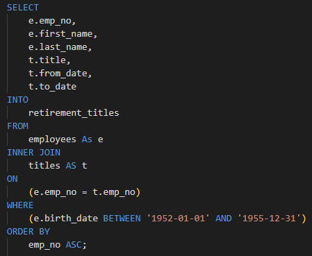
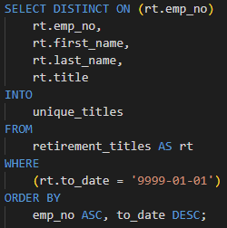
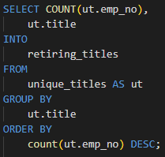
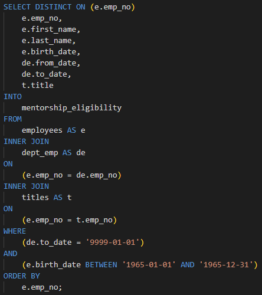

# Pewlett-Hackard-Analysis

## Overview of the Analysis:
- The purpose of this analysis is to prepare Pewlett-Hackard as many of their current employees reach retirement age, aka the "silver tsunami".

### Scope:
- Identify which employees will be eligible to retire soon.
- How many employees will soon be ritiring by title.
- Which employees would be eligible for the mentorship program.
- Utilize QuickDBD and PostgreSQL for this analysis.

 

## Results:
### 1. Retirement_titles table

- This query pulls the basic information for each employee born between 1952 and 1955.
- This is a good start to see who may be retiring soon but unfortunately the data pulls past employees as well as duplicate names for anyone who has ever changed titles while with the company.

 

### 2. Unique_titles table

 - This query utilizes the data from the first but removes all past employees and duplicates with the same employee number which is much more useful information.
 - With this we can see exactly which employee will be potentially retiring soon.

 

 

### 3. Retiring_titles table

- This query gives the most useful information because it shows exactly how many employees will be retiring based off their title.

 

### 4. Mentorship_eligibility table

- The final query is similar to the unique_titles but provides all filters we need to represent the raw data properly.

 

## Summary

### How many roles will need to be filled as the "silver tsunami" begins to make an impact?

- Based off the retiring_titles table there are potentially 72,458 roles that will need to be filled within the next 5 years.

 

### Are there enough qualified, retirement-ready employees in the departments to mentor the next generation of Pewlett Hackard employees?

- Based off the queries there are 72,458 employee retirement-ready employees in the company and 1,549 employees eligible to for the mentorship program.
- If the mentorship program consists of a 1:1 ratio then there will be a deficit of 70,909.
- In order to offset this there would need to be a 47:1 ratio of mentors and mentees which is unrealistic.